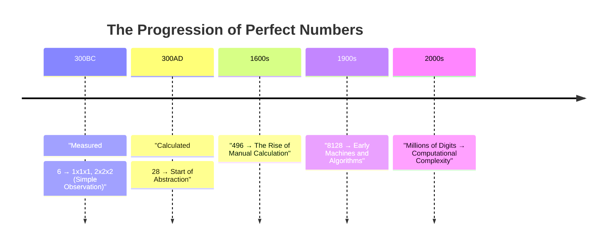
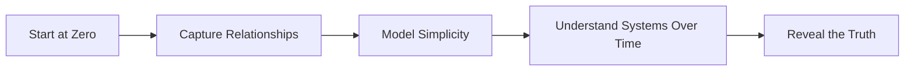

# Beyond the Numbers: How Empathy and Understanding Transform Systems

## Introduction: The Illusion of Complexity
We live in systems driven by metrics—numbers, profits, and measurable outputs. Organizations build entire strategies around calculations, but these often fail to capture the truth. Why? Because they focus on **the surface, not the depth**.

Understanding doesn’t come from dissecting actions or calculating outputs. It comes from seeing **motivations**, understanding relationships, and building empathy. Systems fail when they treat people as metrics instead of individuals with unique contexts and challenges.

> *“People perceive others as complex, but once you empathize, you see past the surface calculation. Complexity gives way to simplicity.”*

---

## From Measuring to Calculating
At the beginning, humanity wasn’t **calculating**—it was **measuring**. The simplest systems were observations:  
- **One unit high. One unit across. One unit deep.**  
- Expand it: **Three units high. Three units across. Three units deep.**  

This was intuitive. It wasn’t about abstraction—it was about seeing relationships in their simplest form.  

Then, as tools and methods advanced, humans started **calculating**. Numbers weren’t just counted; they were combined, multiplied, and transformed. This shift gave us new insights but also led to increasing complexity.  

> *“When measuring, zero is the starting point. When calculating, one is the starting point.”*

**The first leap**: Perfect numbers like **6** and **28** emerged. They were observed using early methods grounded in intuition and relationships.

---

## Perfect Numbers and the Acceleration of Complexity
Perfect numbers are mathematical curiosities that represent harmony. But their discovery tracks the evolution of our tools:  

**Timeline of Perfect Numbers**:  


As our tools advanced (think Moore’s Law—computation doubling every two years), we didn’t move further *outward* into the universe. We zoomed **inward**, calculating ever-smaller slices of truth.  

But the truth didn’t change. Perfect numbers were always there. Our tools just sharpened our focus.  

---

## Complexity is a Distraction
Modern systems thrive on layers of abstraction: algorithms, models, and data so deep that we lose sight of the foundational truths underneath.  

Here’s the profound realization:  
- Bigger calculations ≠ Bigger insights  
- Bigger calculations = Smaller **fractions** of relationships  

Think of zero as the origin and one as the endpoint. Everything between is fractional. As systems grow more complex, we mistake **noise** for progress.  

> *“Complexity doesn’t unlock understanding. Simplicity does.”*

---

## Empathy as a Framework
Empathy isn’t just an emotional tool—it’s a **strategic necessity** for building resilient systems. Consider this:
- Empathy allows you to understand **why people act** the way they do.  
- Understanding motivations helps align systems with people, making them **adaptive and sustainable**.  
- Without empathy, systems become rigid, focused on short-term metrics that ignore long-term human costs.

Example: A simple budget planner captures relationships over time. It’s not just numbers—it’s a living system that adapts and evolves based on decisions. Empathy in this context is understanding **how one choice ripples through the system**, not just in dollars but in outcomes.

---

## Why Systems Fail Without Empathy
Most organizations prioritize metrics over people. This creates a fundamental disconnect:
- **Focus on finance**: Metrics like revenue, KPIs, and performance scores ignore the underlying relationships that drive those outcomes.  
- **Failure to adapt**: Systems designed without empathy collapse under pressure because they lack the flexibility to evolve with human needs.  

Take the Titanic, for example. The ship didn’t sink because of one failure—it was a cascade of decisions made without understanding the **human and systemic dynamics** at play.  

---

## From Complexity to Simplicity
Complexity isn’t the answer. Simplicity—understanding the relationships and motivations driving a system—is where truth lies.  
- **Complexity obscures; simplicity reveals.**  
- By modeling relationships and focusing on motivations, we can build systems that align with people, not just outputs.

This is why frameworks grounded in simplicity matter. Whether modeling cash flow, enterprise IT, or global networks, they focus on **relationships and dynamics** over static calculations.

**Mermaid Flowchart**:  


---

## Closing Thought: A New Lens for Systems and Life
Empathy isn’t just about understanding systems—it’s about understanding the people around us. As you spend time with your family this Christmas, take a moment to step back. If you find yourself frustrated or confused by someone’s behavior, pause. Instead of assuming, ask yourself:  

**What are their motivations? What’s driving this moment?**  

Seeing the world through someone else’s eyes doesn’t just bring understanding—it deepens connection. Your family is there for you, just as you’re there for them. And in the same way we build better systems with empathy, we can build better relationships by simply seeking to understand.

---

**This article stands as a lens for clarity. Let it resonate and spark curiosity to explore the depth of understanding that lies within simplicity.**

```
