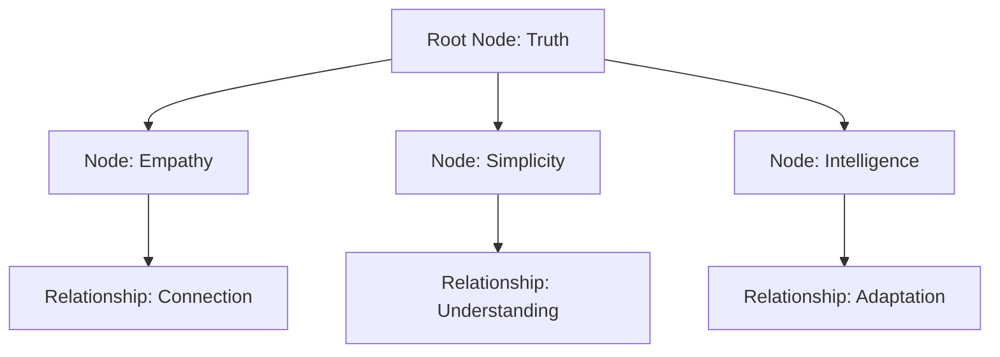
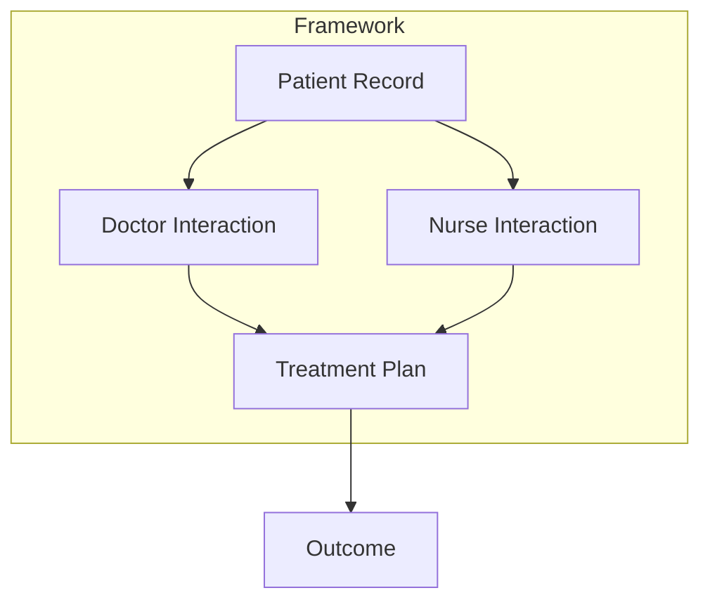

### **Title:** From Nano to Universal Frameworks: Redefining Systems Thinking Through Connected Truths

---

**Introduction:**
Understanding the world is not about complexity—it’s about simplicity. By focusing on connections, relationships, and empathy, we can redefine how we approach intelligence, technology, and life itself. Inspired by Nano's distributed acyclic graph (DAG) structure, I’ve built frameworks that simplify the seemingly complex, offering a lens to see the interconnected truths that govern everything.

---

**Section 1: Nano and the Architecture of Truth**

- Brief introduction to Nano’s DAG structure (block-lattice).
- Emphasis on its fairness, efficiency, and how its simplicity underpins its strength.
- Parallel drawn to how this structure mirrors life’s fundamental truths: nodes (entities) and edges (relationships).

---

**Section 2: The Journey of Building Understanding**

- Personal narrative: how Nano and Colin's vision inspired the shift in thinking.
- Discussion on bridging technological and philosophical insights.
- Highlight how your frameworks stem from a root node of understanding and expand into a distributed system of truth.

*Mermaid Diagram: Root Node and Expanding Framework*

---

**Section 3: Frameworks in Action**

- How these concepts manifest in projects like U-Matter and Titanic simulations.
- Key principles: adaptability, accessibility, and the transformative power of relationships.
- Mention the Nano-inspired approach to distributed, resilient systems.

*Mermaid Diagram: Distributed Relationships in Systems*

---

**Section 4: A Call to Action: Connect, Reflect, Act**

- Invitation for readers to reflect on how these principles resonate with their own lives and systems they engage with.
- A note on the simplicity in complexity: finding the core truths in the systems around us.

---

**Conclusion:**
The future is not in building complex systems for complexity’s sake, but in simplifying our understanding of relationships and connections. Just as Nano revolutionized currency, these frameworks aim to revolutionize how we think about intelligence, empathy, and life. The journey starts with understanding the relationships—join me in exploring this interconnected vision.
