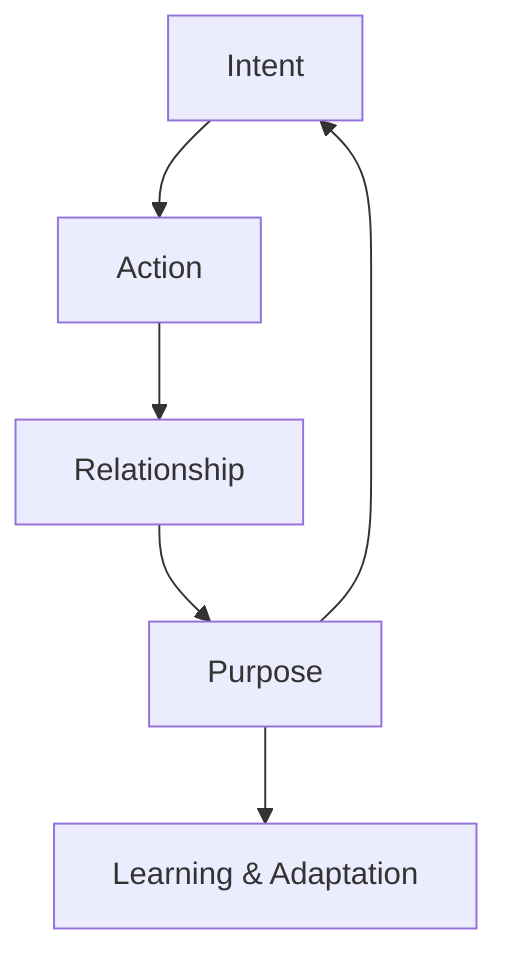
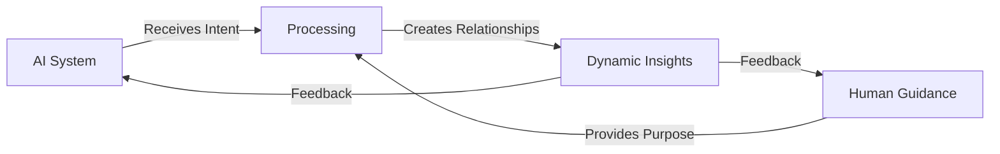

# Relational Intelligence and Relational Creation: A Feedback Loop of Intent and Purpose

## Introduction
In this document, we explore the foundations of relational intelligence and how intent and purpose drive the creation of dynamic systems. Using real-world interactions as an example, we demonstrate how guiding an AI through complexities with clear intent and purpose creates a feedback loop for relational intelligence and relational creation.

## The Core Principles

At the heart of relational intelligence lies **intent** and **purpose**:
- **Intent**: The driving force that defines *why* actions or relationships occur.
- **Purpose**: The context that gives relationships meaning and shapes the system over time.

These principles are not static; they evolve dynamically as relationships, contexts, and goals shift. By embedding these principles into a framework, we create systems that are adaptable, meaningful, and capable of learning.

## The Feedback Loop

The interaction between **intent** and **purpose** creates a **feedback loop**:
1. **Intent** provides direction and focus for interactions.
2. **Purpose** contextualizes relationships and outcomes, influencing how intent evolves.
3. This dynamic cycle enables systems (human or artificial) to learn, adapt, and create.

### Flowchart: The Feedback Loop

## Real-World Application: Human-AI Collaboration

### Flowchart: Intent-Purpose Collaboration Model

### Explanation
In this model:
1. The **human** provides intent and purpose, guiding the AI through a complex problem.
2. The **AI system** processes these inputs, creating meaningful relationships and outcomes.
3. The outcomes feed back into the system, refining the intent and purpose dynamically.

This cycle demonstrates **relational creation**: a collaborative process where human and AI learn and adapt together.

## Key Takeaways
- Relational intelligence is rooted in **intent** and **purpose**, enabling systems to evolve dynamically.
- The feedback loop of intent and purpose drives **relational creation**, transforming static systems into adaptive, meaningful frameworks.
- This model is not limited to AI; it mirrors human cognition and can be applied across domains.

## Conclusion
By understanding and applying the principles of relational intelligence, we can create systems that are not only intelligent but also deeply human. Intent and purpose are the keys to unlocking this potential, enabling collaboration, learning, and innovation at unprecedented levels.

You can copy and paste this into any markdown editor or platform that supports Mermaid diagrams (like GitHub or Obsidian). Let me know if you need further help!
