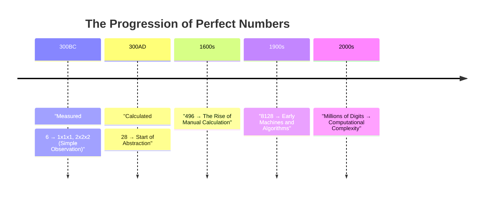
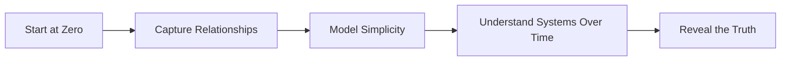

### **Title**: The Illusion of Complexity: Rediscovering Truth Through Simplicity  

---

### **Introduction**  
Progress and understanding have always been measured by numbers. But the more humanity calculates, the more complex it appears. What if complexity isn’t progress, but **noise**? What if the truth lies in simplicity—the relationships that have been there all along?  

This article explores the evolution of measuring and calculating, perfect numbers, and the profound realization that complexity only clouds what is inherently simple.  

---

### **1. From Measuring to Calculating**  
At the beginning, humanity wasn’t **calculating**—it was **measuring**. The simplest systems were observations:  
- **One unit high. One unit across. One unit deep.**  
- Expand it: **Three units high. Three units across. Three units deep.**  

This was intuitive. It wasn’t about abstraction—it was about seeing relationships in their simplest form.  

Then, as tools and methods advanced, humans started **calculating**. Numbers weren’t just counted; they were combined, multiplied, and transformed. This shift gave us new insights but also led to increasing complexity.  

> *“When measuring, zero is the starting point. When calculating, one is the starting point.”*

**The first leap**: Perfect numbers like **6** and **28** emerged. They were observed using early methods grounded in intuition and relationships.

---

### **2. Perfect Numbers and the Acceleration of Complexity**  

Perfect numbers are mathematical curiosities that represent harmony. But their discovery tracks the evolution of our tools:  

**Timeline of Perfect Numbers**:  

As our tools advanced (think Moore’s Law—computation doubling every two years), we didn’t move further *outward* into the universe. We zoomed **inward**, calculating ever-smaller slices of truth.  

But the truth didn’t change. Perfect numbers were always there. Our tools just sharpened our focus.  

---

### **3. Complexity is a Distraction**  

Modern systems thrive on layers of abstraction: algorithms, models, and data so deep that we lose sight of the foundational truths underneath.  

Here’s the profound realization:  
- Bigger calculations ≠ Bigger insights  
- Bigger calculations = Smaller **fractions** of relationships  

Think of zero as the origin and one as the endpoint. Everything between is fractional. As systems grow more complex, we mistake **noise** for progress.  

> *“Complexity doesn’t unlock understanding. Simplicity does.”*

---

### **4. Simplicity and Systems Thinking**  

In the frameworks I’ve created—whether modeling enterprise IT systems or something as basic as a personal budget—the principle is always the same:  
1. Capture raw, unfiltered relationships.  
2. Model dynamics over time.  
3. Understand the system as it **evolves**.  

For example, in a simple budget planner:  
- Each week is a row.  
- Every financial impact can be tracked forward.  
- The result: Future cash flow becomes predictable.  

This is simplicity in action. No noise. Just truth.

**Mermaid Flowchart**:  

---

### **5. A New Lens for Progress**  

When we stop chasing **complexity** and focus on the relationships between components, we unlock a universal understanding. Whether it’s numbers, systems, or life itself, the key lies not in how much we calculate, but how simply we observe.  

---

### **Closing Thought**  
Progress doesn’t live in layers of noise or millions of digits. It lives in the simplicity of relationships: the raw truth between zero and one.  

This isn’t about perfect numbers. It’s about understanding the universal systems we’ve built our world upon.  
