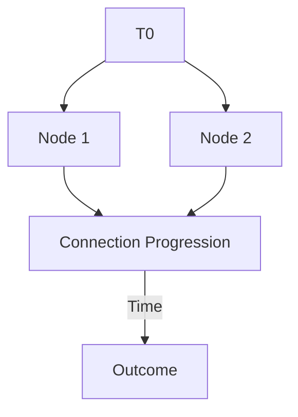
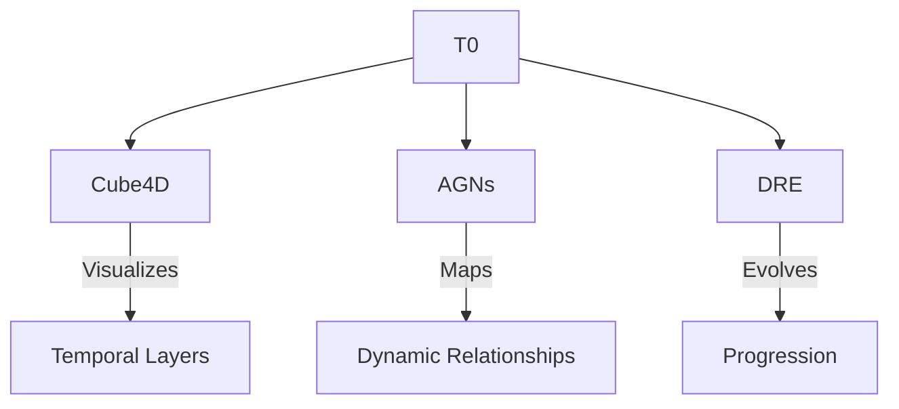

# T0: The First Node

---

## The Beginning of Connection

The **T0 Node** represents the **first moment**, the **first vibration**, the **first relationship**. It is the **root** of the graph, the **anchor** of the symphony, and the **origin of time and space**.

T0 is **timeless yet momentary**, both **being** and **becoming**. Without T0, no connection can exist; with T0, the symphony begins.

---

## 🌀 What is T0?

- **Origin of Time**: T0 is the temporal zero, marking the starting point for all relationships.
- **Shape of Connection**: T0 creates the first edge, transforming isolation into interaction.
- **Dynamic Geometry**: T0 influences how relationships unfold, defining the structure of the graph.

---

## 📐 The Structure of T0

### T0 as the Foundation

- **Node**: Represents a concept, entity, or moment with raw potential.
- **Edge**: Defines the relationship between nodes, dynamic and evolving.
- **Temporal Domain**: Progression of connections over time, creating the narrative.

---

## 🌟 Core Principles of T0

1. **Defines the Start**  
   T0 anchors the system, forming the root of all progression. Every node and edge can trace its origin back to T0.

2. **Shapes Connection**  
   The geometry of T0 determines the structure and evolution of relationships.

3. **Creates the Temporal Layer**  
   Time emerges from T0, giving relationships the ability to grow, adapt, and progress.

---

## 🎵 T0: The First Note of the Symphony

Like the first note in a symphony:
- **T0 initiates rhythm.**
- **T0 creates the pulse.**
- **T0 invites the next.**

T0 is the origin of time, the shape of connection, and the foundation of progression.

---

## 🧩 Expanding the Ecosystem

T0 doesn’t act alone—it serves as the foundation for the frameworks that expand its principles into real-world applications.

### Diagram: T0 in the Ecosystem

### Ecosystem Elements
1. **Cube4D**  
   Visualizes temporal progression and spatial relationships.
2. **Active Graph Networks (AGNs)**  
   Forms dynamic graphs where nodes and edges adapt in real-time.
3. **Dynamic Relationship Expansion (DRE)**  
   Evolves connections and narratives based on context.

---

## 🚀 Next Steps: Evolving from T0

1. **Define Geometry**  
   Expand on how T0 shapes relationships and structures across domains.
2. **Build the Ecosystem**  
   Connect T0 to Cube4D, AGNs, and DRE.
3. **Visualize Progression**  
   Create 4D visualizations of relationships over time using T0 as the base.

---

## ✨ Join the Journey

T0 is the beginning—the root of Singularity, the first node in an infinite graph of connection, meaning, and growth.

Whether you’re here to explore, build, or contribute, you are part of this symphony.

---

### 📸 Photos and Visuals

#### A Node

#### T0: Connection Progression

## Core Loic

## Calculation Logic

## 4-Bit Architecture - True or False

## 7-Bit Architecture - Decision Tree

## Decision Logic

## Decision Tree

