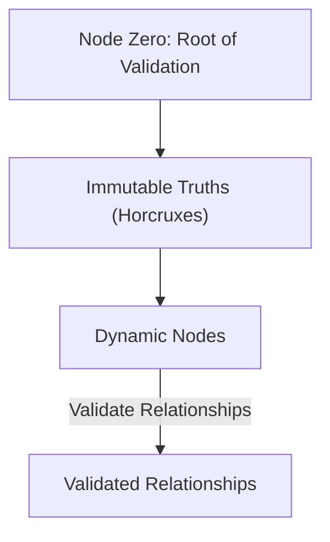
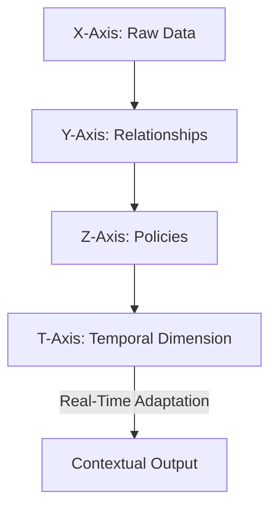
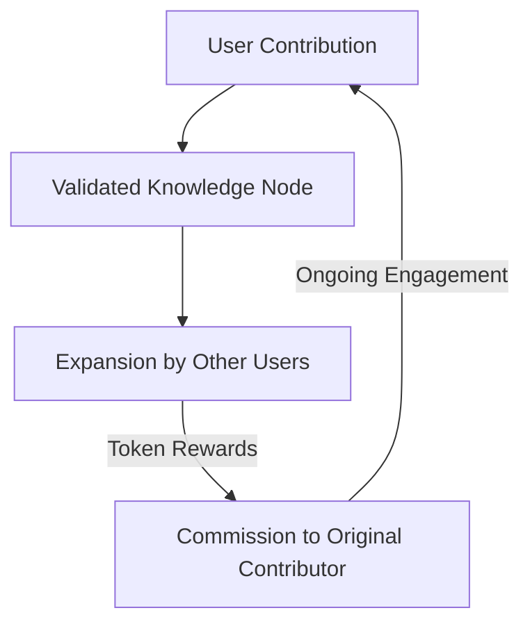
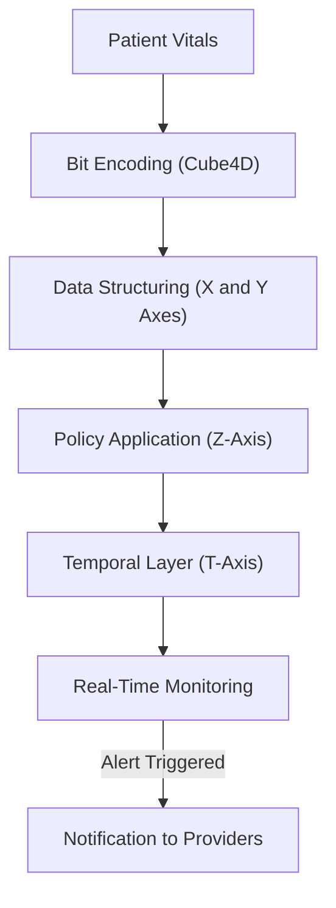
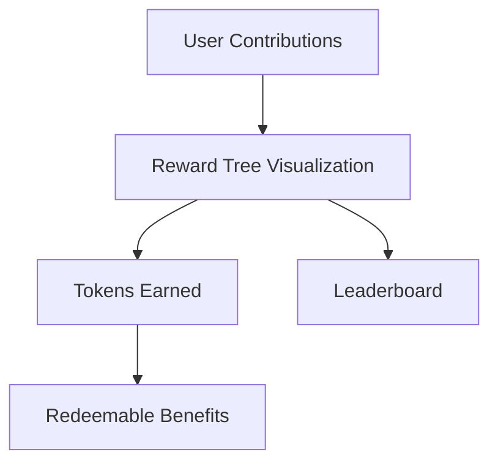

# **QuantumFlux: Visualizing the Framework**

This document provides a series of **mermaid diagrams** with explanations to break down the core concepts of QuantumFlux into visual workflows. These diagrams aim to enhance understanding and accessibility.

---

## **1. Immutable Truths and Validation**

The foundation of QuantumFlux lies in **Node Zero**, which anchors the system's validation process. Immutable truths (Horcruxes) ensure consistency and trust across the network.

### **Explanation**:
- **Node Zero** serves as the genesis node, anchoring all validations.
- **Horcruxes** act as immutable truths, forming the core validation references.
- **Dynamic Nodes** validate their relationships against these immutable truths to ensure consistency.

---

## **2. Cube4D Framework**

The Cube4D framework organizes data across four dimensions: X (data), Y (relationships), Z (policies), and T (time).

### **Explanation**:
- **X-Axis** represents raw data points or knowledge bases.
- **Y-Axis** captures relationships between these data points.
- **Z-Axis** governs policy-driven adaptability for dynamic relationships.
- **T-Axis** incorporates time as a layer for real-time and historical analysis.

---

## **3. Tokenized Knowledge Contribution**

Contributors earn tokens for their inputs and commissions when their contributions are expanded upon.

### **Explanation**:
- **User Contribution**: Initial input into the network, such as adding a node or relationship.
- **Validated Knowledge Node**: Contributions validated through immutable truths and policies.
- **Expansion by Other Users**: Other users build upon validated nodes.
- **Token Rewards**: Contributors earn tokens for their input and a percentage of future expansions.
- **Ongoing Engagement**: Encourages sustained participation in the knowledge network.

---

## **4. Healthcare Workflow**

A real-world example of QuantumFlux in action: monitoring patient vitals and generating alerts in emergencies.

### **Explanation**:
- **Input**: Patient vitals are continuously monitored.
- **Bit Encoding**: Data is encoded using Cube4D's efficient bit encoding system.
- **Data Structuring**: Organizes data across X and Y axes for analysis.
- **Policy Application**: Applies predefined emergency policies.
- **Temporal Layer**: Incorporates time-sensitive layers for real-time monitoring.
- **Real-Time Monitoring**: Checks for policy trigger conditions.
- **Output**: Alerts are sent to healthcare providers when thresholds are breached.

---

## **5. Community Engagement**

The gamified reward system encourages collaboration and sustained engagement.

### **Explanation**:
- **User Contributions**: Users contribute knowledge, validate truths, or expand relationships.
- **Reward Tree Visualization**: A graphical representation of how contributions grow and generate value.
- **Tokens Earned**: Contributors earn tokens for their validated inputs.
- **Redeemable Benefits**: Tokens can be exchanged for advanced features, governance votes, or real-world rewards.
- **Leaderboard**: Highlights top contributors and impactful nodes, fostering friendly competition.

---

## **Conclusion**
These diagrams illustrate the key workflows and concepts of QuantumFlux, making its innovative framework more accessible and actionable. Each section builds upon the next, creating a comprehensive visualization of how QuantumFlux transforms knowledge networks.

---
