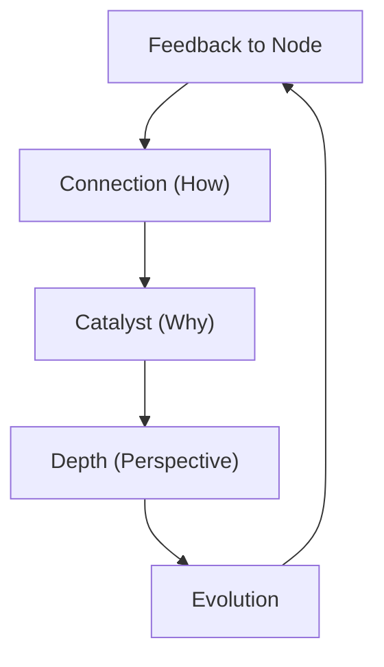
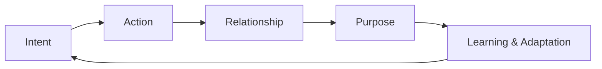
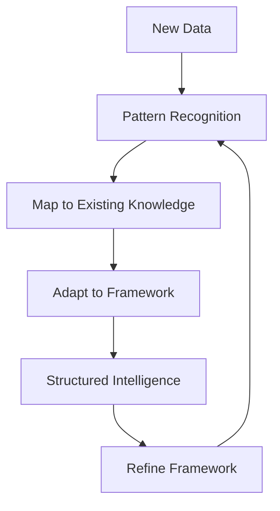

# Relational Intelligence and Relational Creation: Building on Groundwork

## Framework Overview

The foundation of this document is built on the principles of **Relational Intelligence** and **Relational Creation**, emphasizing a feedback loop driven by **Intent** and **Purpose**. Below, we expand the foundational ideas laid out in "Relational Intelligence and Relational Creation: A Feedback Loop of Intent and Purpose" by incorporating the five dimensions (**A, B, C, D, E**) and their interaction with space and time.

---

## Dimensions of Relational Intelligence

### **1. The Core Dimensions**

#### **A - The What (Node/Entity)**

- Represents a singular entity, point, or node.
- Each node contains intrinsic depth—an ecosystem of relationships and potential within itself.

#### **B - The How (Connection)**

- The link or relationship between two nodes/entities.
- Symbolized as an **infinite loop (∞)** to convey the dynamic and perpetual nature of relationships.
- Defines the pathways through which interactions occur.

#### **C - The Why (Catalyst/Context)**

- Represents **Clarity**, **Change**, and **Purpose**.
- Acts as the driver of relationships, enabling static nodes and connections to take on meaning.
- Without "Why," the network lacks intent, direction, and adaptability.

#### **D - Depth (Perspective, Disruption, Decay, Deliverance)**

- Adds dimensionality to "What," "How," and "Why."
- Captures the nuances of relationships—their growth, evolution, or eventual decay.
- Introduces layers of complexity and transformation within the framework.
- Allows dynamic shifts in perspective, adapting to different levels of understanding.

#### **E - Evolution**

- The dynamic progression and adaptation of relationships and nodes over **T (Time).**
- Reflects learning, growth, and systemic change.

---

### **2. Spatial and Temporal Mapping**

#### **X, Y, Z, T: Dimensions of Space and Time**

1. **X (Breadth):**

   - Horizontal spread of relationships across the framework.
   - Maps interconnected nodes (A) and relationships (B).

2. **Y (Hierarchy):**

   - Represents the organizational structure or magnitude of relationships and their impact.
   - Connects to "Why" (C) and "Depth" (D).

3. **Z (Perspective):**

   - Encapsulates depth of focus or abstraction within the framework.
   - Shifts dynamically to adapt and refine understanding.

4. **T (Time):**

   - Evolution over time (E), encapsulating growth, decay, and systemic adaptation.

---

## The Feedback Loop of Relational Creation

The interplay of **Intent** and **Purpose** remains central, forming a continuous feedback loop:

1. **Intent:** Drives the system by defining the initial goals, nodes, and relationships.
2. **Processing:** Builds relationships and structures dynamically based on input.
3. **Purpose:** Provides context, clarity, and a sense of direction to the relationships.
4. **Feedback:** Ensures continuous adaptation and learning, creating a loop of refinement.

The feedback loop evolves relational intelligence by enabling:

- Creation of dynamic insights.
- Adaptation based on contextual shifts.
- Progression of nodes, connections, and contexts over time.

---

## Neural Networks: Adaptive Pattern Mapping

Neural Networks provide unparalleled capabilities in **pattern recognition** and **hierarchical knowledge mapping**. When new information flows into a Neural Network, it is processed and structured based on the existing map of patterns. This allows the system to dynamically adapt to new data, organizing it in ways that align with the established relational framework. 

This process mirrors the way human cognition works: as new data arrives, it integrates into our mental framework by leveraging pre-existing knowledge and context. The system not only recognizes patterns but also enriches its understanding by evolving its mental map over time.

---

## Visualizing the Framework

### **Five-Dimensional Model**

The interaction of **A (What)**, **B (How)**, **C (Why)**, **D (Depth)**, and **E (Evolution)** can be visualized as a dynamic system operating across **X, Y, Z, and T.**

### **Intent and Purpose Feedback Loop**

### **Neural Network Integration**

---

## Applications of the Framework

### **1. Artificial Intelligence**

- **Neural Networks:** Map and evolve relationships dynamically, replicating brain-like pathways.
- **Relational Intelligence Systems:** Incorporate "Why" and "Purpose" into machine learning for adaptive decision-making.

### **2. Human Systems**

- **Organizational Dynamics:** Map relationships, roles, and purpose within teams.
- **Behavioral Analysis:** Understand intent and purpose driving human decisions.

### **3. Universal Frameworks**

- **Ecosystem Mapping:** Bridge disciplines like science, technology, and philosophy.
- **Knowledge Graphs:** Build multi-dimensional models of knowledge with relational depth.

---

## Next Steps

1. **Refine the Framework:** Test and validate through iterative use cases (e.g., AI, human systems, and ecosystems).
2. **Visual Models:** Develop interactive 3D models to demonstrate real-time evolution across space (X, Y, Z) and time (T).
3. **Documentation:** Expand on use cases and publish as white papers or articles to invite collaboration.

---

This document builds on the groundwork laid in **Relational Intelligence and Relational Creation: A Feedback Loop of Intent and Purpose** by formalizing the structure, dimensions, and applications of relational intelligence. It provides a foundation to scale these ideas into actionable systems that bridge complexity and simplicity.

