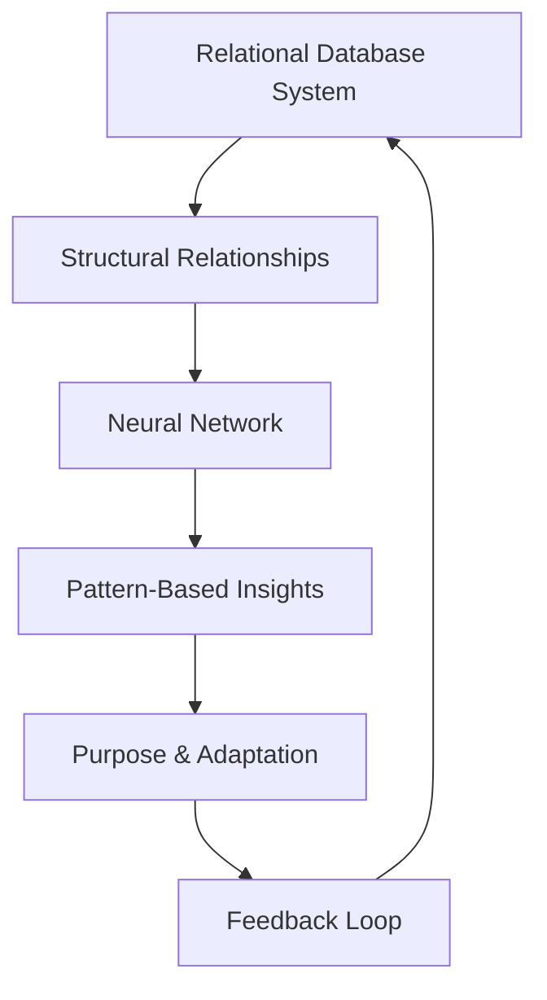

# Neural Networks and Relational Databases: Bridging Two Paradigms

## Introduction

This document builds on the foundational principles laid out in "Relational Intelligence and Relational Creation: A Feedback Loop of Intent and Purpose." We now turn our focus to the convergence of **Neural Networks** and **Relational Database Management Systems (RDBMS)**, exploring how these two paradigms can synergize to create a new class of intelligence frameworks.

The integration of **pattern recognition** (Neural Networks) with **structured relational mapping** (RDBMS) offers a unique pathway to evolve dynamic, adaptive systems rooted in intent, purpose, and depth.

---

## Core Concepts

### **Neural Networks**

Neural Networks emulate the brain's ability to recognize patterns, learn from data, and generalize insights. Key features include:

- **Nodes:** Represent processing units (neurons) with intrinsic relationships to other nodes.
- **Connections:** Weighted links defining the relationship strength between nodes.
- **Adaptability:** The capacity to adjust weights and biases based on feedback loops, enabling learning and evolution.

### **Relational Databases (RDBMS)**

RDBMS excel in managing structured data with defined relationships, offering clarity and precision through:

- **Tables (Entities):** Analogous to nodes in neural networks, representing data points.
- **Relationships:** Foreign keys and joins establish explicit connections.
- **Queries:** SQL enables precise extraction of information based on conditions and relationships.

### **The Bridge: Intent and Purpose**

The fusion of Neural Networks and RDBMS lies in their complementary strengths:

- Neural Networks provide **pattern-based inference and adaptability.**
- RDBMS ensure **structural clarity and relationship integrity.**

By embedding **intent** (goals) and **purpose** (context) into their interaction, the two systems can synergize to:

1. **Adapt:** Dynamically adjust relationships based on learned patterns.
2. **Structure:** Maintain clarity and accountability in data relationships.
3. **Evolve:** Progress over time while retaining traceability and consistency.

---

## Framework for Integration

### **1. Relational Nodes**

- Treat each **RDBMS entity (table)** as a **node** within the neural network.
- Nodes possess intrinsic **attributes (columns)** and inter-node relationships (foreign keys).

### **2. Dynamic Relationships**

- Replace static foreign key relationships with **adaptive connection weights** influenced by neural network training.
- For example:
  - In an e-commerce database, the relationship between "User" and "Product" can evolve based on purchasing patterns.

### **3. Depth and Perspective**

- Introduce the concept of **depth (D)** to RDBMS relationships:
  - Example: A single join may reveal a shallow connection (e.g., a purchase), but a sequence of joins (e.g., purchase + review + refund) provides relational depth.
- Use neural networks to evaluate and prioritize perspectives, allowing dynamic shifts in focus.

### **4. Temporal Evolution**

- Integrate **time (T)** as a dimension within RDBMS to track relationship evolution.
- Use neural networks to predict future relational states based on historical data.

---

## Visualizing the Integration

### **Intent and Purpose in Action**



### **Dynamic Depth Mapping**

```mermaid
graph TD
    NodeA[Node A (User)] --> NodeB[Node B (Product)]
    NodeB --> NodeC[Node C (Review)]
    NodeC --> NodeD[Node D (Refund)]
    subgraph DepthAnalysis
        NodeA --> NodeC
    end
    DepthAnalysis --> Prediction[Neural Network Prediction]
```

---

## Applications

### **1. Intelligent Recommendation Systems**

- **Problem:** Traditional recommendation engines rely on predefined relationships.
- **Solution:** Integrate neural networks to adaptively learn user preferences and dynamically redefine relationships.

### **2. Dynamic Fraud Detection**

- **Problem:** Fraud detection systems rely on static relational rules.
- **Solution:** Combine neural network’s anomaly detection with RDBMS’ traceability to build a real-time, adaptive fraud detection system.

### **3. Autonomous Knowledge Graphs**

- **Problem:** Knowledge graphs lack adaptability.
- **Solution:** Use neural networks to continuously update graph relationships while maintaining RDBMS’ clarity and structure.

---

## Challenges and Opportunities

### **Challenges**

1. **Integration Complexity:** Bridging neural network adaptability with relational rigidity requires careful orchestration.
2. **Scalability:** Balancing computational demands of neural networks with the efficiency of RDBMS.
3. **Interpretability:** Neural networks can be opaque, whereas RDBMS are inherently transparent.

### **Opportunities**

1. **Unified Systems:** Create platforms combining the best of both paradigms.
2. **Enhanced Decision-Making:** Enable organizations to leverage structured and unstructured data simultaneously.
3. **Human-Like Intelligence:** Move closer to building systems with reasoning akin to human cognition.

---

## Conclusion

The convergence of Neural Networks and Relational Databases holds the key to a new class of intelligence frameworks. By integrating adaptability, structure, and purpose, we can create systems that not only understand relationships but evolve them dynamically over time.

This document lays the groundwork for a unified approach to relational intelligence, bridging the structured precision of RDBMS with the adaptive power of neural networks. The next step is to prototype and validate these ideas across real-world applications.

