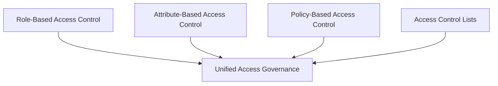
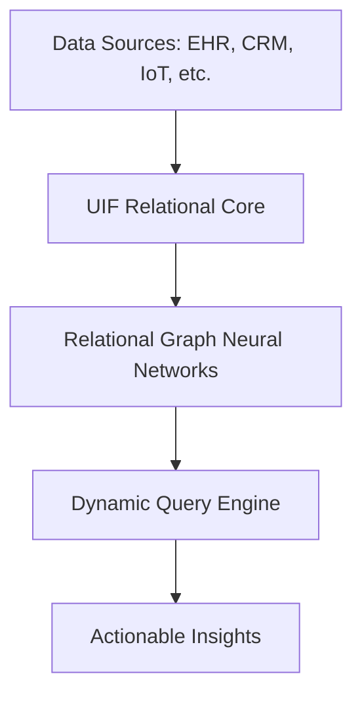
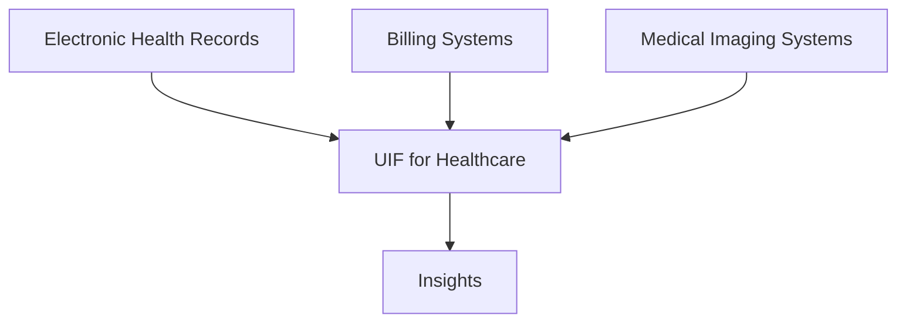

# Universal Intelligence Framework (UIF)

## Introduction
The **Universal Intelligence Framework (UIF)** is a modular, scalable, and intelligent system designed to abstract, connect, and query data relationships across siloed systems. It integrates modern principles like **RBAC**, **ABAC**, **PBAC**, **ACL**, and **Relational Graph Neural Networks (RGNNs)** into a seamless layer, offering a powerful yet simple approach to solving data interoperability challenges.

This document formalizes UIF's structure and principles, illustrating how it can be applied across industries such as **healthcare**, **finance**, and **logistics** to unlock the potential of relational intelligence.

---

## Core Components of UIF

### 1. Access Control Models
UIF incorporates a tiered access governance model:
- **Role-Based Access Control (RBAC):** Permissions are tied to roles.
- **Attribute-Based Access Control (ABAC):** Access is granted based on data attributes and conditions.
- **Policy-Based Access Control (PBAC):** Centralized policy rules govern who can access data and why.
- **Access Control Lists (ACLs):** Fine-grained, object-level permissions.

#### Flowchart: Access Governance

---

### 2. Relational Intelligence Core
The backbone of UIF lies in its ability to **structure and query data relationships** dynamically, regardless of the system’s origin. Key features include:
- **Relational Graph Neural Networks (RGNN):** Enables predictive insights and contextual analysis of data relationships.
- **RDBMS Compatibility:** UIF seamlessly overlays existing relational databases, making it non-disruptive and highly adaptable.
- **Logic-First Schemas:** Relationships between data points are defined using first-principles logic.

#### Flowchart: Relational Intelligence Workflow

---

### 3. Interoperability
UIF bridges siloed systems by creating an **abstraction layer** that standardizes data access while respecting organizational boundaries:
- **FHIR for Healthcare:** Enables interoperability across healthcare systems.
- **API-First Design:** Extensible for custom integrations.
- **Data Mapping:** Uses schema overlays to connect disparate data formats.

---

## Example Use Case: Healthcare

In **healthcare**, siloed systems like EHRs, patient records, and billing systems create inefficiencies and missed insights. UIF addresses this by:
1. **Connecting Data:** Mapping relationships between patient records, clinical data, and operational metrics.
2. **Predictive Intelligence:** Using RGNNs to forecast patient outcomes or detect fraud.
3. **Access Governance:** Ensuring compliance with RBAC, ABAC, and PBAC for HIPAA and GDPR.

#### Flowchart: Healthcare Data Integration

---

## Key Benefits

### Simplicity
UIF abstracts the complexity of relational intelligence into a single framework. Organizations no longer need disparate tools for each specific challenge.

### Scalability
Its modular design ensures UIF can grow with organizational needs, adapting to new data sources and systems.

### Security
UIF’s strict access controls provide peace of mind, ensuring compliance without sacrificing usability.

### Predictive Power
RGNNs offer a competitive advantage by unlocking actionable insights from relational data.

---

## Next Steps
1. **Define Use Cases:** Expand this document with industry-specific applications (e.g., finance, logistics).
2. **Flowchart Enhancements:** Add detailed flowcharts for specific processes using tools like Mermaid.js.
3. **Implementation Roadmap:** Outline step-by-step instructions for integrating UIF into existing systems.
4. **Documentation Repository:** Create a GitHub repo for collaboration and ongoing updates.

---

## Appendix

### References
- RBAC, ABAC, PBAC, ACL: Industry-standard models for access control.
- RGNN: [Graph Neural Networks for Relational Data](https://arxiv.org/abs/1810.00826)
- FHIR: [Fast Healthcare Interoperability Resources](https://www.hl7.org/fhir/)
