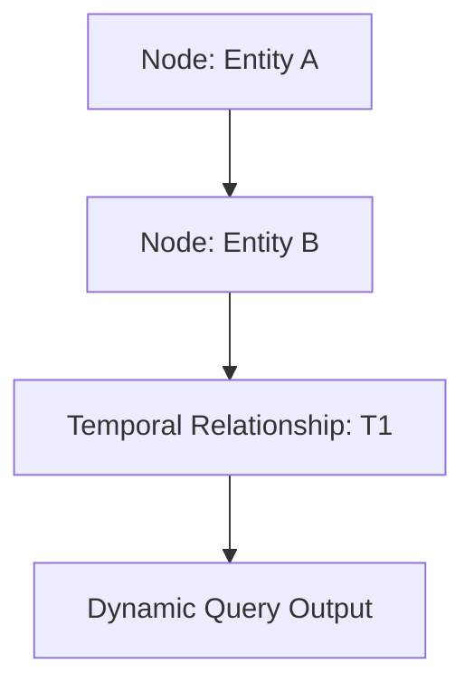
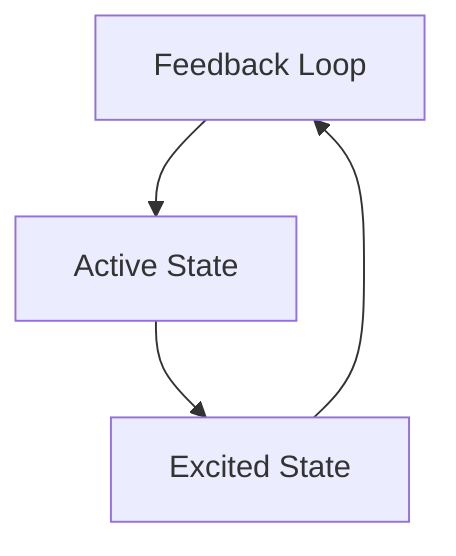

# Universal Intelligence Framework: Redefining Intelligence Beyond AI

**By Callum Maystone**

---

## **Introduction**

The **Universal Intelligence Framework (UIF)** is a groundbreaking system designed to dynamically map, process, and evolve complex relationships across multi-dimensional spaces. Built on foundational principles like **Active Graph Networks (AGN)**, **Cube4D**, and **Dynamic Relationship Expansion (DRE)**, UIF offers a scalable, queryable, and actionable approach to modeling intelligence beyond conventional AI systems.

Aligned with innovations like **NVIDIA’s Neural Information Model (NIM)** platform, UIF represents a new frontier in **multi-dimensional query processing**. While NIM processes complex queries across vast computational frameworks, UIF builds the **contextual and relational maps** necessary to make those queries meaningful and dynamic.

---

## **The Core of UIF**

### **Active Graph Networks (AGN): Mapping Relationships Dynamically**
AGN is the backbone of UIF, enabling nodes and edges to evolve dynamically based on context, policies, and temporal states.

- **Nodes as Entities**: Represent individuals, objects, or systems.
- **Edges as Relationships**: Capture connections like causality, dependency, or influence.
- **Dynamic Queries**: Enable real-time exploration of evolving data.



---

### **Cube4D: Temporal Layering for Multi-Dimensional Insights**
Cube4D provides a temporal foundation, modeling data across three key states:
- **T0**: Resting State (Historical Context)
- **T1**: Active State (Real-Time)
- **T2**: Excited State (Predictive/Projected)

This layered approach allows UIF to process **time-sensitive queries** while retaining historical and predictive insights.



---

### **Dynamic Relationship Expansion (DRE): Context in Action**
DRE enables relationships to evolve dynamically, adapting to changing conditions and policies. This is critical for domains like healthcare, finance, and IoT.

- **Example**: A healthcare framework dynamically adjusts patient treatment plans based on real-time data and historical trends.

```json
{
  "source": "PatientA",
  "target": "TreatmentPlanB",
  "relationship": "undergoing treatment",
  "temporal_policy": {
    "state": "active",
    "start_time": "2024-12-01",
    "end_time": "2025-01-01"
  }
}
```

---

## **Alignment with NVIDIA’s NIM Platform**

The **NVIDIA Neural Information Model (NIM)** platform excels at processing **multi-dimensional queries and tasks**. UIF complements this by:
- **Providing Context**: UIF builds the relational maps and frameworks that NIM can process efficiently.
- **Enhancing Multi-Dimensional Queries**: With Cube4D and DRE, UIF ensures that data queries are both scalable and contextually aware.
- **Dynamic Adaptation**: AGNs dynamically evolve relationships, offering NIM an ever-relevant data structure to compute against.

**Example Use Case**:
In a financial fraud detection system:
- **UIF** models the relationships between transactions, accounts, and anomalous behavior over time.
- **NIM** processes the computational queries, identifying high-risk patterns in real time.

---

## **Applications of UIF**

### **1. Healthcare**
Dynamic patient modeling using Cube4D to track treatments and predict outcomes.

### **2. IoT Systems**
Scaling intelligent device ecosystems by modeling relationships between sensors, devices, and networks.

### **3. Financial Systems**
Detecting fraud through dynamic relationships and temporal patterns.

### **4. Structural Engineering**
Modeling failures dynamically to predict and prevent structural collapse.

---

## **The Future of Intelligence**

By aligning with frameworks like NVIDIA’s NIM, UIF is poised to redefine how we process, model, and act on complex data relationships. Its dynamic, multi-dimensional nature unlocks the potential for **intelligence that adapts, evolves, and scales** with real-world needs.

Are you ready to explore the future? Let’s connect and build it together.

---

## **Diagrams and Code**

Mermaid diagrams and sample queries included above are just the beginning. Explore the full repository of UIF on [GitHub](https://github.com/ConicuConsulting/SlappAI) and see how these frameworks can transform your approach to intelligence.
